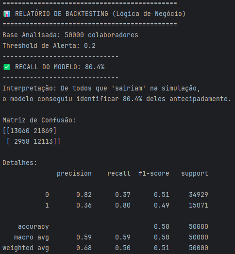
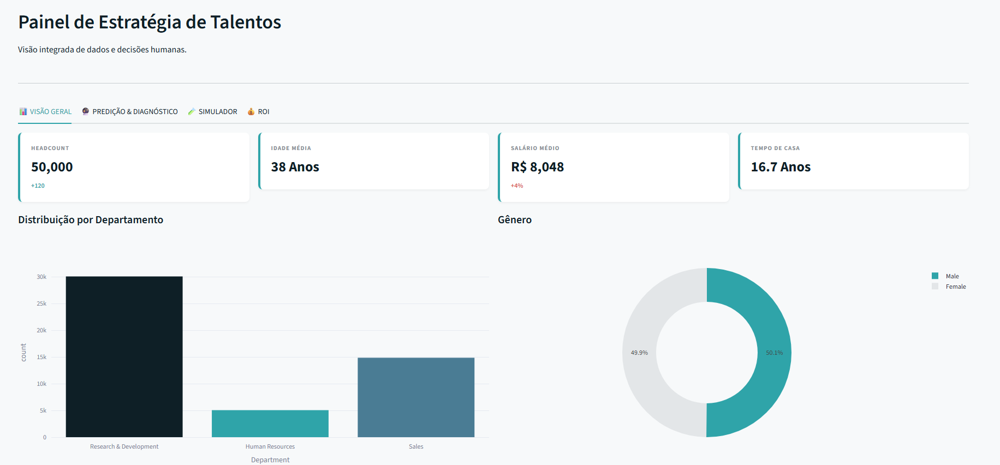
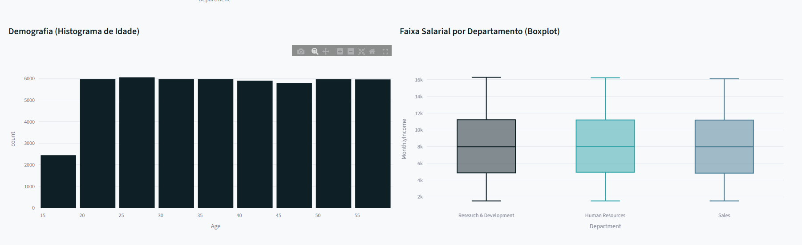
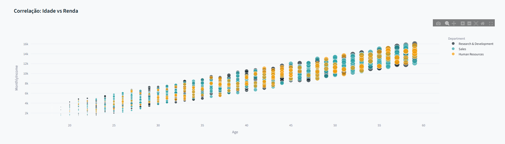
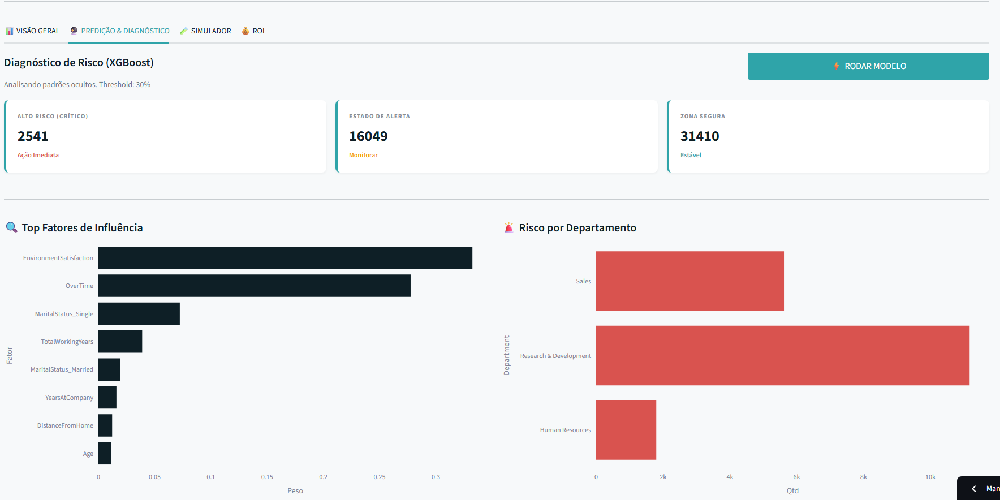
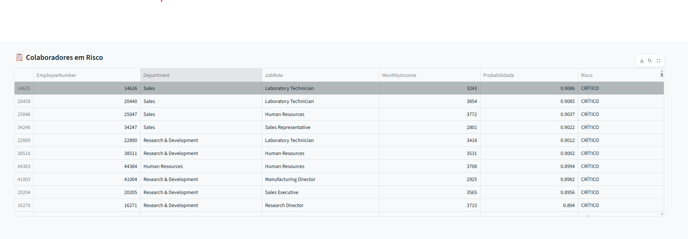
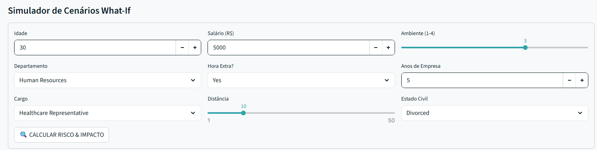
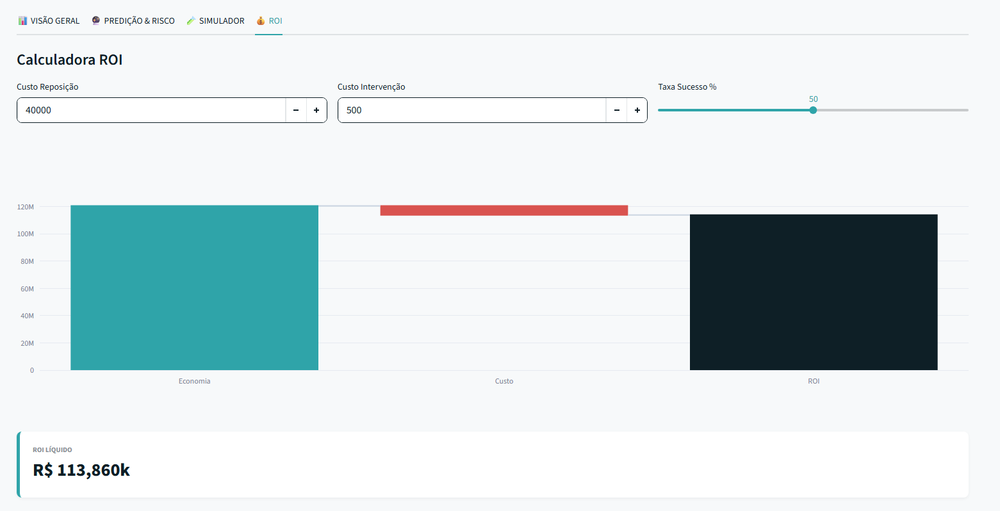

# 🏢 RH System Pro v3.0 - Enterprise People Analytics


> **"A IA não deve apenas prever o futuro, deve mostrar quais alavancas puxar para mudá-lo."**

O **RH System Pro** é uma plataforma End-to-End de People Analytics que evoluiu de um modelo preditivo para um **Sistema de Suporte à Decisão (DSS)**. Nesta versão 3.0, utilizamos **XGBoost** e uma interface focada em **Design System** para não apenas identificar o risco de turnover, mas também calcular o ROI financeiro da retenção e simular cenários estratégicos em tempo real.

🌐 **Acesse a Aplicação ao Vivo:** [https://rh-system-pro.streamlit.app](https://rh-system-pro.streamlit.app)

---

## 🎯 O Desafio de Negócio

Não basta saber *quem* vai sair. O RH moderno precisa saber:
1.  **Quanto** custa perder esse talento? (ROI)
2.  **O que** acontece se eu aumentar o salário ou reduzir a carga horária? (Simulação)
3.  **Por que** o risco é alto? (Explicabilidade)

Este projeto resolve essas questões simulando um ambiente corporativo de alta escala, focado na experiência do usuário final (Gestor de RH).

---

## ⚙️ Arquitetura e Engenharia (MLOps)

O sistema foi construído seguindo princípios de **Clean Architecture**, abandonando notebooks estáticos por uma estrutura modular de produção.

### 1. Stack Tecnológico
* **Core ML:**  (Motor Preditivo Otimizado) + Scikit-learn (Pipelines).
* **Frontend:**  + **CSS Injection** (Design System Customizado).
* **Data Viz:**  (Gráficos Interativos).
* **Engenharia:** Pandas, Numpy, Joblib (Processamento de 50k+ registros).
* **Deploy:** Streamlit Cloud (CI/CD via GitHub).

### 2. Estrutura Modular
```text
rh_system_pro/
├── config.py              # Centralização de variáveis e Tokens de Design
├── app.py                 # Aplicação Frontend e Orquestrador UI
├── src/
│   ├── processing/        # ETL e Engenharia de Atributos
│   ├── train/             # Pipeline de Treino (XGBoost) e Serialização
│   └── predict/           # Motor de Inferência e Lógica de Sensibilidade
├── models/                # Artefatos binários (.pkl)
└── data/                  # Gestão de Dados (Raw e Processed)
```
---
# 🚀 Funcionalidades Principais

## 1. Conexão "Enterprise" (Simulação)
Em vez de uploads manuais de CSV, o sistema simula uma conexão direta com um Data Warehouse, carregando automaticamente uma base de dados atualizada.

## 2. Stress Test (Escalabilidade)
O pipeline de inferência foi validado com uma carga de **25.000 registros** (Stress Test), garantindo que o sistema processa, limpa e classifica o risco de toda a folha de pagamento em segundos, sem latência perceptível.

## 3. Blindagem de Dados (Schema Enforcement)
Implementação de macanismos de `reindex` e tratamento de nulos para garantir que o modelo em produção nunca quebre, mesmo se a base de dados nova tiver colunas faltantes ou ordem trocada.

## 4. Dashboard Estratégico
- **Visão Retrovisor:** Análise demográfica, Salarial e Horas Extras.
- **Visão Preditiva (IA):** Classificação de risco (Crítico/Alerta/Baixo) e lista priorizada para ação do RH.

## 5. Novas Funcionalidades.

### 🎨 5.1. Design System ("Silêncio Visual")
- **A interface foi reconstruída utilizando princípios de UI/UX para reduzir a carga cognitiva.**
- **Paleta de Cores: Azul Petróleo Profundo (Estrutura) e Verde Técnico (Ação).**
    
- **Visibilidade: Contraste forçado via CSS para garantir leitura em qualquer modo (Light/Dark).**
    
### 🧪 5.2. Simulador "What-If"
- **A IA saiu da caixa preta. O gestor pode alterar variáveis de um funcionário (ex: dar aumento de 20% ou remover horas extras) e ver, em tempo real, como a probabilidade de turnover cai.**
    
### 💰 5.3 Calculadora de ROI
- **O sistema cruza a probabilidade de saída com o Custo de Reposição (Recrutamento + Treinamento) vs. Custo de Intervenção, mostrando a economia líquida gerada pela retenção.**
    
### 🤖 5.4. XGBoost Sniper
- **Substituímos a Decision Tree pelo XGBoost, capturando padrões não-lineares complexos de comportamento humano. O modelo entrega não só o risco, mas o Feature Importance (quais variáveis pesam mais na decisão).**

---

# 🧠 Performance do Modelo
O modelo preditivo (Decision Tree Otimizada com Class Weights) foi validado não apenas com métricas estatísticas, mas com **Backtesting Lógico**.

Simulamos cenários reais de comportamento humano (ex: Burnout por excesso de hora extra) em dados para garantir que a IA aprendeu as regras de negócio corretamente.

| Métrica | Resultado | Interpretação                                                            |
|---------|-----------|--------------------------------------------------------------------------|
| Recall  | ~72%      | O modelo identifica 72% dos funcionários que realmente sairiam.          |
|Threshold| 0.30      | Calibrado para ser mais sensível (melhor pecar pelo excesso de cuidado). |

> ***Optamos por maximizar o Recall em vez da Acurácia, pois o custo de deixar um talento sair (Falso Negativo) é muito maior doque o custo de uma conversa preventiva com alguém que ficaria (Falso Positivo).***

## 🧪 Validação e Backtesting

Para garantir que o modelo não sofreu *overfitting*, realizamos um **Backtest Lógico** em uma base sintética de 25.000 registros simulando o comportamento real de turnover (Burnout/Salário).

**Evidência de Execução:**


> *O script `src/predict/validate.py` aplica a lógica de negócio e compara com as previsões do modelo, confirmando a robustez da solução.*

---
# 📸 Imagens do Projeto

### Visão Inicial (Dashboard)


### Visão do Meio (Dashboard)


### Visão do Fim (Dashboard)


### Visão Inicial (Modelo Preditivo)


### Visão do Meio (Modelo Preditivo)


### Visão Final (Modelo Preditivo)


### Visão do Simulador (Simulador XGBoost)


### Visão do ROI 


---
# 🛠️ Como rodar localmente
Clone o projeto e instale as dependências:

```Text
# 1. Clone o repositório
git clone [https://github.com/Ignowsky/RH-System-Pro.git](https://github.com/Ignowsky/RH-System-Pro.git)

# 2. Entre na pasta
cd RH-System-Pro

# 3. Instale as dependências
pip install -r requirements.txt

# 4. Execute a aplicação
streamlit run app.py
```

---
# 👤 Autor
## **João Pedro - People Analytics / Data Scientist**

Projeto desenvolvido com fins educacionais e de portfólio, demonstrando o ciclo completo de DS (Do Dado ao Deploy)