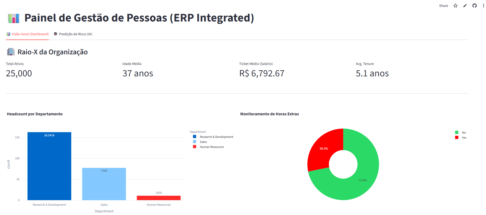
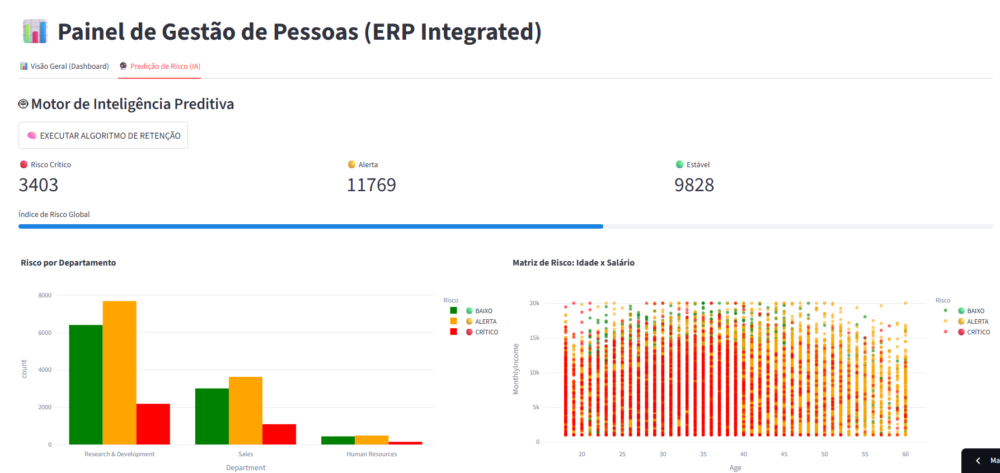
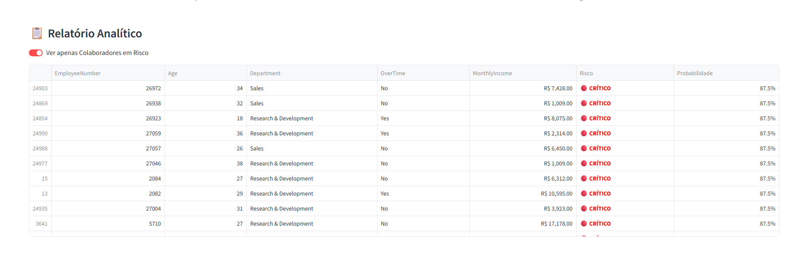

# 🏢 RH System Pro - Enterprise People Analytics


> **"Data Science não é apenas treinar modelos, é entregar valor na ponta."**

O **RH System Pro** é uma plataforma End-to-End de People Analytics projetada para prever o risco de turnover (rotatividade) de colaboradores. Diferente de notebooks estáticos, este projeto simula um ambiente de produção corporativo, capaz de processar grandes volumes de dados, validar regras de negócio e entregar insights acionáveis via Dashboard Interativo.

🌐 **Acesse a Aplicação ao Vivo:** [https://rh-system-pro.streamlit.app](https://rh-system-pro.streamlit.app)

---

## 🎯 O Problema de Negócio

A perda de talentos custa caro. Substituir um funcionário pode custar até 2x o seu salário anual, sem contar a perda de conhecimento e impacto na cultura.

O desafio deste projeto foi responder a três perguntas:
1.  **Quem** está em risco de sair da empresa?
2.  **Por que** eles estão saindo? (Burnout, Salário, Estagnação?)
3.  **Como** entregar essa informação ao RH de forma rápida e escalável?

---

## ⚙️ A Solução e Arquitetura

O sistema foi construído seguindo princípios de **Engenharia de Machine Learning (MLOps)** e **Clean Architecture**.

### 1. Stack Tecnológico
* **Linguagem:** Python 3.10+
* **Frontend:** Streamlit (com Plotly para visualização de dados).
* **Backend/ML:** Scikit-learn, Pandas, Numpy, Joblib.
* **Controle de Versão:** Git & GitHub.
* **Deploy:** Streamlit Cloud (CI/CD integrado).

### 2. Estrutura Modular
O projeto abandonou a estrutura linear de Jupyter Notebooks para uma arquitetura de pacotes Python robusta:

```text
turnover_project/
├── config.py              # Gerenciamento centralizado de caminhos e variáveis
├── app.py                 # Aplicação Frontend (Streamlit)
├── src/
│   ├── processing/        # Pipeline de Limpeza e Feature Engineering (ETL)
│   ├── train/             # Pipeline de Treinamento e Persistência do Modelo
│   └── predict/           # Pipeline de Inferência e Validação (Backtesting)
├── models/                # Artefatos serializados (.pkl)
└── data/                  # Armazenamento de dados (Raw e Processed)
```
---
# 🚀 Funcionalidades Principais

## 1. Conexão "Enterprise" (Simulação)
Em vez de uploads manuais de CSV, o sistema simula uma conexão direta com um Data Warehouse, carregando automaticamente uma base de dados atualizada.

## 2. Stress Test (Escalabilidade)
O pipeline de inferência foi validado com uma carga de **25.000 registros** (Stress Test), garantindo que o sistema processa, limpa e classifica o risco de toda a folha de pagamento em segundos, sem latência perceptível.

## 3. Blindagem de Dados (Schema Enforcement)
Implementação de macanismos de `reindex` e tratamento de nulos para garantir que o modelo em produção nunca quebre, mesmo se a base de dados nova tiver colunas faltantes ou ordem trocada.

## 4. Dashboard Estratégico
- **Visão Retrovisor:** Análise demográfica, Salarial e Horas Extras.
- **Visão Preditiva (IA):** Classificação de risco (Crítico/Alerta/Baixo) e lista priorizada para ação do RH.

---

# 🧠 Performance do Modelo
O modelo preditivo (Decision Tree Otimizada com Class Weights) foi validado não apenas com métricas estatísticas, mas com **Backtesting Lógico**.

Simulamos cenários reais de comportamento humano (ex: Burnout por excesso de hora extra) em dados para garantir que a IA aprendeu as regras de negócio corretamente.

| Métrica |Resultado|Interpretação|
|---------|---------|-------------|
| Recall  |~76%|O modelo identifica 76% dos funcionários que realmente sairiam.|
|Threshold|0.30|Calibrado para ser mais sensível (melhor pecar pelo excesso de cuidado).|

> ***Optamos por maximizar o Recall em vez da Acurácia, pois o custo de deixar um talento sair (Falso Negativo) é muito maior doque o custo de uma conversa preventiva com alguém que ficaria (Falso Positivo).***

## 🧪 Validação e Backtesting

Para garantir que o modelo não sofreu *overfitting*, realizamos um **Backtest Lógico** em uma base sintética de 25.000 registros simulando o comportamento real de turnover (Burnout/Salário).

**Evidência de Execução:**


> *O script `src/predict/validate.py` aplica a lógica de negócio e compara com as previsões do modelo, confirmando a robustez da solução.*

---
# 📸 Imagens do Projeto

### Visão Inicial (Dashboard)


### Visão Final (Dashboard)


### Visão Inicial (Modelo Preditivo)


### Visão Final (Modelo Preditivo)


---
# 🛠️ Como rodar localmente
Clone o projeto e instale as dependências:

```Text
# 1. Clone o repositório
git clone [https://github.com/Ignowsky/RH-System-Pro.git](https://github.com/Ignowsky/RH-System-Pro.git)

# 2. Entre na pasta
cd RH-System-Pro

# 3. Instale as dependências
pip install -r requirements.txt

# 4. Execute a aplicação
streamlit run app.py
```

---
# 👤 Autor
## **João Pedro - People Analytics / Data Scientist**

Projeto desenvolvido com fins educacionais e de portfólio, demonstrando o ciclo completo de DS (Do Dado ao Deploy)